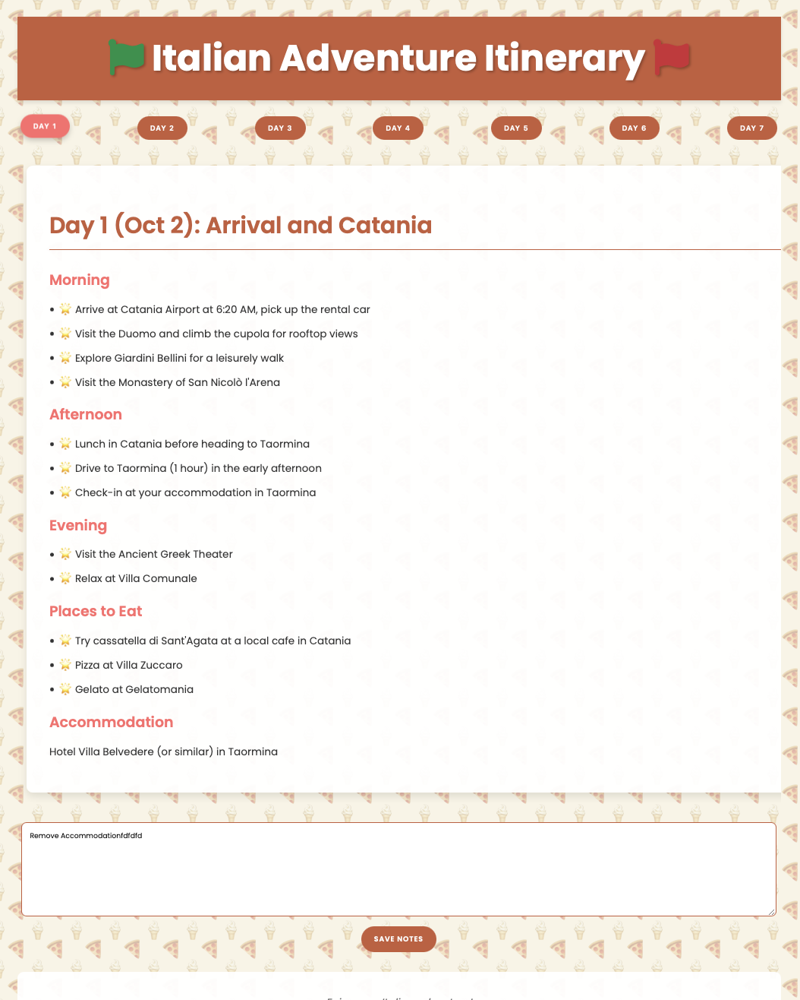

# Vacation Itinerary App

## Overview
This web application is designed to help users plan and document their vacations. Users can view daily itineraries, take notes, and save their travel experiences.

## Features
- **Daily Itinerary Display**: Users can navigate through different days of their itinerary.
- **Notes Section**: A text area for users to jot down their travel notes.
- **Save Notes**: Users can save their notes for each day, which can be retrieved later.
- **Responsive Design**: The application is designed to work on both desktop and mobile devices.
- **Dynamic URL Parameters**: Users can select a day from the itinerary, and the URL updates accordingly to reflect the selected day.

## Technologies Used
- **HTML**: For structuring the web pages.
- **CSS**: For styling the application with a modern design.
- **JavaScript**: For dynamic functionality, including fetching itinerary content and saving notes.
- **Markdown**: The itinerary content is written in Markdown format for easy editing.

## Installation
1. Clone the repository:
   ```bash
   git clone <repository-url>
   cd vacation_itinerary
   ```
2. Install dependencies (if any).
3. Run the following command to start the application:
   ```bash
   docker-compose up --build
   ```
4. Open the `localhost:7001`

## Usage
- Navigate through the days of your itinerary using the buttons provided.
- Enter your notes in the text area and click the "Save Notes" button to save them.
- The application will display a message confirming that your notes have been saved.

## Screenshots


## License
This project is licensed under the MIT License.

## Acknowledgments
- Designed for travelers to document their vacations.